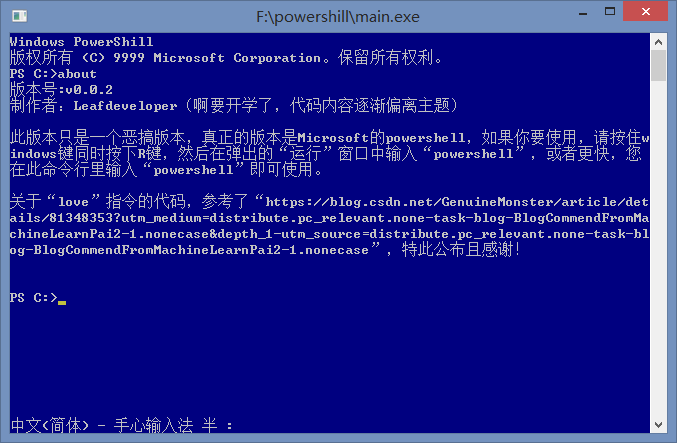

## Powershill

### 必须放在开头的声明

这个项目只是一个对于powershell的恶搞，并不是对于powershell的侵权，只是觉得好玩。如果你要使用powershell，请前往github，microsoft的<a href="https://github.com/PowerShell/PowerShell">PowerShell</a>！

### 这个项目是怎么来的？

这个项目是我之前在看到jvav的源码之后，感觉编程里鬼畜也不是特别难，便想跃跃欲试，于是就出现了这个项目。

本项目采用C++编写，由于只花了两天时间来完成这个项目，代码的错误和未实现的点肯定很多，忘各位开发者给予纠正。

### 主要介绍

这个是一个十分好（bushi）的命令行，您可以十分畅快的使用它，尤其是可以在你查看文件时一直帮你打印（稀里糊涂），是不是很强大？（bushi）尤其是当你正在输入命令的时候还有可能帮助您关机，可见他的强大，可以帮助您关机减轻你的压力（大型咒骂现场）。

### 我对于powershell的看法

对于我来说，powershell是一个非常好的命令行，还跨平台，对我来说十分实用。我恶搞powershell其实更多的是对于powershell的喜爱，让更多人能以这种欢笑的方式入坑powershell，让他们知道——powershell不比cmd差。

### ChangeLog

2020.8.9 第一个版本更新

2020.8.29 v0.0.2更新，更改“移除“version”命令，增加“about”命令，且更新“love”命令
